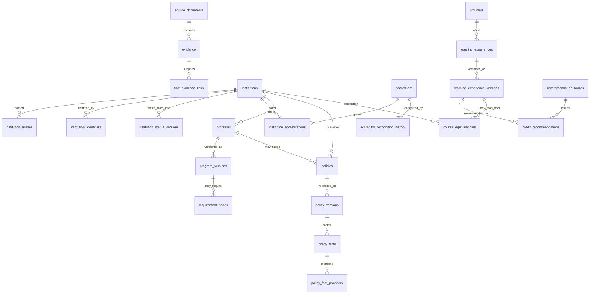

# Data model

Cardinalities below are the V1 relationships. Empty BUILD NEXT tables are included so their boundaries stay visible.

## Identity and names

`catalog.institutions` is one row per institution that survived entity resolution in the extract. Kaplan University is a `former_name` of Purdue University Global, not a second institution. Brandman University is a `former_name` of UMass Global. Excelsior College is a `former_name` through 2022-07-31; Excelsior University is the `official_name` from 2022-08-01. The day-before end is an interpretation of "became Excelsior University on August 1, 2022." The source did not publish a separate last day. That evidence is medium confidence.

`catalog.institution_relationships` can record merges and campus relationships later. V1 does not invent a UNITID-continuity row for Kaplan.

## Accreditation is not recognition

`catalog.accreditors` is the agency. `catalog.accreditor_recognition_history` is whether a recognition authority (here, the U.S. Department of Education) recognized that agency. `catalog.institution_accreditations` is whether an institution held a grant from that agency.

ACICS recognition is `terminated` as of 2022-08-19. No institution accreditation row points at ACICS. ITT has a closure status and no accreditation grant in this extract. UMPI's row is `university_system_participation`, not a standalone institutional grant. DEAC has a self-description source. ED recognition of DEAC is a research gap, not a recognition row.

`historical_classification_label` is stored only when a source used a classification word. The extract does not store "regional."

## Learning and recommendations

`alternative.providers` is the organization (Study.com, Sophia Learning, StraighterLine, Coopersmith Career Consulting). `alternative.learning_experiences` is the stable course or exam. `learning_experience_versions` is a dated description. `credit_recommendations` is one recommendation period from one recommendation body.

Study.com Philosophy 102: Ethics in America (`SDCM-0160`) has one ACE recommendation from 2023-11-01 through 2027-03-31, inclusive. Recommended credits, level, and subject are null. Coopersmith Recruitment and Selection has `identifier_status = not_captured` and no recommendation row.

## Policy facts

`policy.policies` is the policy identity, optionally scoped to one program. `policy.policy_versions` carries valid time and a required source document. `policy.policy_facts` is the typed statement: transfer maximum, no numeric cap, residency minimum, minimum grade, course age, alternative-credit limit, acceptance condition, source distinction, transcript routing, program restriction, or application note.

A fact may link providers with `addresses`, `accepts`, `rejects`, or `eligible_method`. Charter Oak's partner policy uses `addresses`.

## Equivalency and requirements

`transfer.course_equivalencies` requires a source experience or a source course, a destination institution, and a source document. `direct_course` also requires a destination course version. A row here still does not mark a degree requirement satisfied.

`academic.requirement_nodes` can later represent ALL, ANY, MIN_CREDITS, MIN_COURSES, COURSE, CATEGORY, ATTRIBUTE, RESIDENCY, and GPA. `get_program_requirements` returns `requirement_status = not_documented` and `practical_max_transfer = null` while the tree is empty.

## Provenance link

`fact_evidence_links` stores `fact_schema`, `fact_table`, and `fact_id` rather than a foreign key to every fact table. That keeps one evidence model across accreditation, policy, recommendations, and equivalencies. The application checks that the schema and table are public before returning them.
